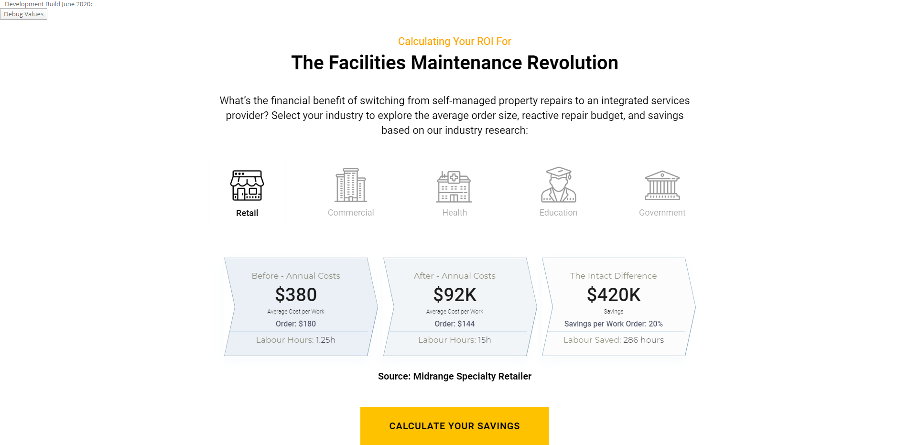
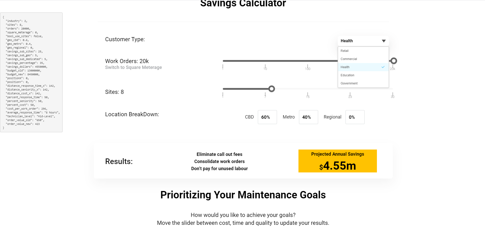
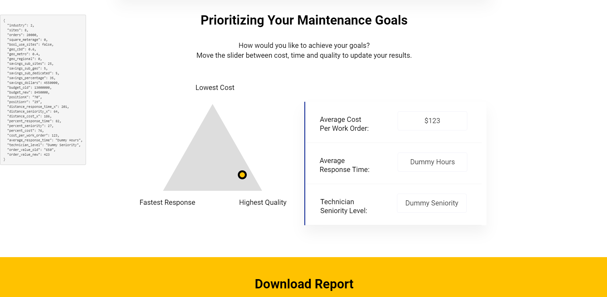
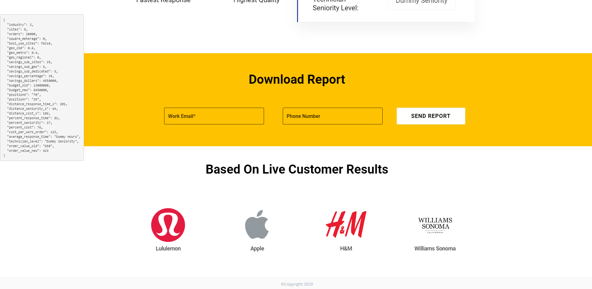

# Wyn Calculator System 4

A React-based calculator system designed for internal demos and customer instances.

## Technologies Used
- React 16.11.0
- React Bootstrap
- React Router DOM
- Email Validator
- HTML2Canvas (for PDF generation)
- Mailgun.js
- And more...

## Prerequisites
- Node.js (v10.x or higher)
- npm (Node Package Manager)

## Installation
1. Clone the repository
2. Install dependencies:
```bash
npm install
```

## Available Scripts
- `npm start` - Runs the app in development mode at [http://localhost:3000](http://localhost:3000)
- `npm build` - Builds the app for production to the `build` folder
- `npm test` - Launches the test runner in interactive watch mode
- `npm run dev` - Runs the app with AWS Lambda runtime for development

## Active Branches
1. **Master** - Internal Demo (Calculator 2)
2. **Intact** - Intact Customer Instance (Calculator 1)

## Features
- Interactive calculator interface
- PDF generation capabilities
- Email validation
- Responsive design
- Custom slider components

## Screenshots









## Contributing
Please read the contribution guidelines before submitting any pull requests.

## License
This project is private and proprietary. All rights reserved.

